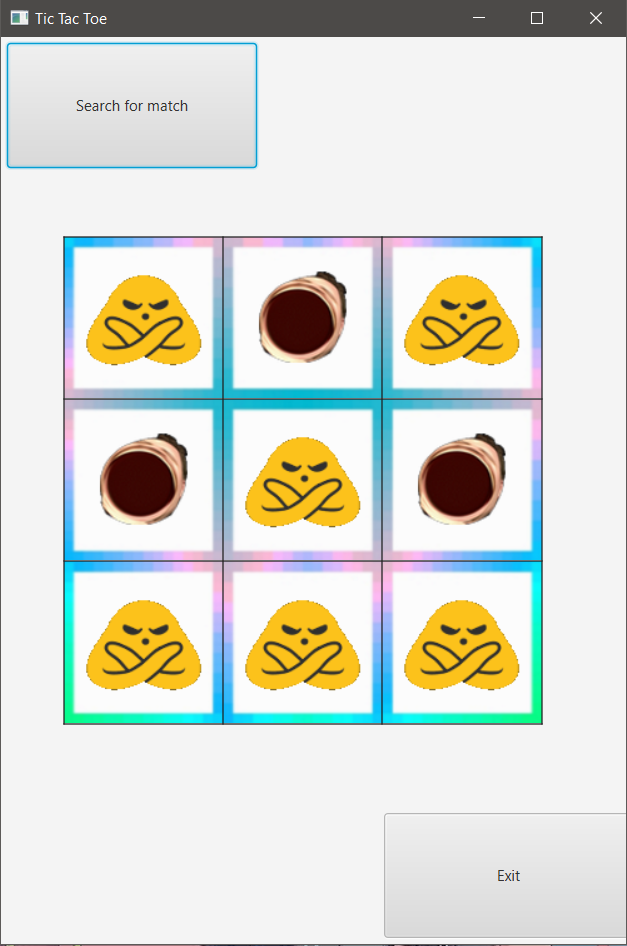

# Group Project 

## About
This repository contains a tic-tac-toe game that will blow your mind.

The application features a gui that shows the tic-tac-toe board and buttons to search for an opponent connected to the same server.
It runs on a local server which handles 2 players and sets the game state.

#### Running Application

## Installation
1. Download or clone the package.

``git clone https://github.com/PaulKatigbak/GroupAssignment.git``

1. Open IntelliJ
2. Go to File>Open>Cloned project
3. Go to File>Project Structure>Project, ensure you're on Java 15 or newer (We used version 15.0.2)
4. Go to File>Project Structure>Libraries>plus button, Add in your javafx library sdk (We used 15.0.1)
5. Press Apply and Ok
6. Go to Run>Edit Configuration
7. Press the plus on the top left
8. Click on application
9. Click on Modify Options dropdown and hit "Add VM Options"
10. Add VM options like so: '--module-path "PATH TO JAVAFX LIBRARY" --add-modules javafx.controls,javafx.fxml'
    (Change the PATH)
11. Make sure the Main class is set to sample.Main
12. Go to configuration settings and allow 'run multiple instances' under modify option. (ONLY FOR MAIN)

13. Hit Apply
14. Do step 7 to 11 again but this time Main class is sample.Server
15. Hit Apply and OK
16. You can now run the server by pressing the run or play button once
17. Run Main twice to open to UI windows.

## Guideline Questions Answered
1. The team was able to properly identify and set a realistic project within the given timeframe.
2. The implementation is able to execute perfectly. The code was also made with proper coding practices and comments to help guide readers. The implementation does not have executable versions.
3. README contains all necessary information about the project.
4. The project was able to implement all the proposed scopes while also having a pleasing and intuitive gui.

## Contributors
##### Members:
Andrew Chai (The Hippo God)\
Wahbi Raihan (The Wabzter)\
Evan Curtis (The Ekan)\
Paul Gabriel Katigbak (The Mall Cop)
